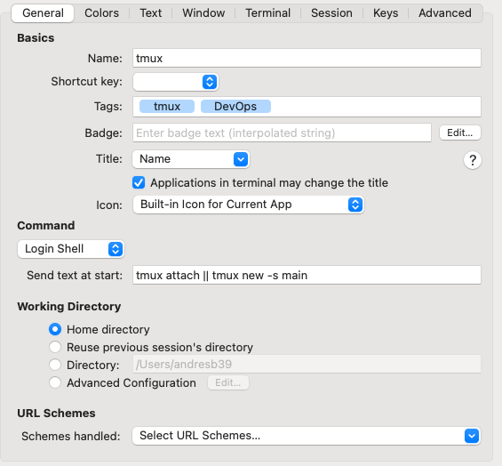

# dotfiles

This repository holds my configuration files for the applications listed below.

- [x] [tmux](https://github.com/tmux/tmux/wiki)
- [x] [neovim](https://github.com/neovim/neovim)
- [x] [yabai](https://github.com/koekeishiya/yabai)
- [x] [skhd](https://github.com/koekeishiya/skhd)

1. **tmux**: The .tmux.conf file contains my custom configurations for the Tmux terminal multiplexer. It includes key bindings, status bar customization, and other Tmux settings.

2. **neovim**: The nvim folder contains my configuration files for the neovim text editor. It includes plugins, key mappings, color schemes, and other settings to enhance my editing experience

3. **yabai**: The yabai folder contains my configuration files for the yabai window manager. It includes settings for window management, desktop layouts, and other customization options.

4. **skhd**: The skhd folder holds my configuration files for the skhd hotkey daemon. It includes key bindings for various actions, such as launching applications, switching between windows, and controlling the window manager.

By organizing these configuration files in a repository, I can easily track changes, share them with others, and quickly set up my preferred configurations on different machines.

## Repository structure
```shell
.
└── config
   ├── nvim
   │  └── lua
   │     └── andresb39
   │        ├── core
   │        └── plugins
   │           └── lsp
   ├── skhd
   ├── tmux
   │  ├── plugins
   │  │  ├── tmux
   │  │  │  ├── data
   │  │  │  └── scripts
   │  │  ├── tmux-sensible
   │  │  └── tpm
   │  │     ├── bin
   │  │     ├── bindings
   │  │     ├── docs
   │  │     ├── lib
   │  │     │  └── tmux-test
   │  │     ├── scripts
   │  │     │  └── helpers
   │  │     └── tests
   │  │        └── helpers
   │  └── scripts
   └── yabai
      └── scrips
```

## Configuration

To set up the applications, just follow the steps provided below.

### tmux

1. Copy the directory **tmux** into `~/.config`
2. Copy the **tmux.conf** in your home `~/.tmux.conf`
3. Start using tmux. `tmux attach || tmux new -s main`

### Demo

[](https://asciinema.org/a/627075)

**Bonus!!!**

- Configuration for ***item2***.



### nvim

**Requirement:** ***npm***

1. Simply copy the **nvim** directory to `~/.config`.
2. Install plugins.
   1. Open nvim.
   2. Use `:Lazy` to install or update plugins.

### Demo

[](https://asciinema.org/a/627078)

### yabai

1. Copy the **yabai** directory to `~/.config`.
2. Run the command `yabai --start-service` to restart yabai.

### skhd

1. Copy the **skhd** directory to `~/.config`.
2. Run the command `skhd --start-service` to restart skhd.

That's it! Your applications are now configured and ready to use. Enjoy!
